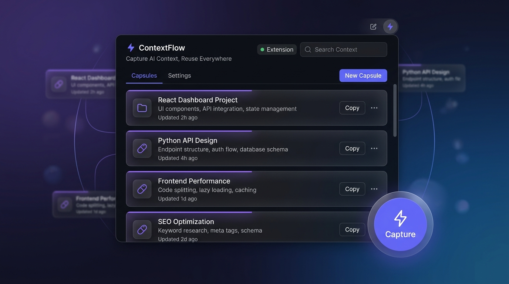

<div align="center">

# ⚡ ContextFlow — AI Context Manager

### Capture AI context once. Reuse it everywhere. Forever free.

**Stop re-explaining your project to every AI tool you switch to.**



[](LICENSE)
[](CHANGELOG.md)
[]()
[](CONTRIBUTING.md)
[](https://github.com/contextflow/extension)
[](https://github.com/contextflow/extension/fork)

> **Free, open source, unlimited AI context manager. No accounts. No paywalls. Your data never leaves your device.**

[📦 Install](#installation) · [📖 How It Works](#how-to-use) · [🤝 Contribute](CONTRIBUTING.md) · [🐛 Report Bug](https://github.com/contextflow/extension/issues)

</div>

---

## What is ContextFlow?

ContextFlow is a Chrome extension that lets you **capture AI conversation context once and reuse it across any AI platform** — ChatGPT, Claude, Gemini, Grok, Perplexity, DeepSeek, Mistral, and more. Built as a fully open-source, zero-cost alternative to Capsule Hub.

🧠 **One capture. Every AI. Zero friction.**

---

## Why ContextFlow vs Capsule Hub?

| Feature | Capsule Hub | ContextFlow |
|---|---|---|
| Price | Freemium (2-3 capsules free, then paid) | **100% Free, forever** |
| Capsule limit | Capped on free tier | **Unlimited** |
| Account required | Yes | **No account needed** |
| Data storage | Uploaded to Tilantra servers | **100% local (your device)** |
| Open source | No | **Yes (MIT License)** |
| Works on Grok | No | **Yes** |
| Works on DeepSeek | Limited | **Yes** |
| Works on any AI site | No | **Yes (universal)** |
| Edit capsules (clear UI) | Confusing | **Simple, clear form** |
| Permissions | High-risk (reads your Gmail, Outlook) | **Minimal — no email access** |
| Version history | Yes (paid) | **Yes (free, local)** |
| Export data | Limited | **Full JSON export/import** |
| Team sharing | Paid | **Export JSON and share freely** |
| Offline use | No (server-dependent) | **Yes (works offline)** |

---

## Features

### 🎯 Core
- **Capture context** from any AI conversation with one click (⚡ button or Ctrl+Shift+S)
- **Inject context** into any AI chat with one click — works everywhere
- **Universal** — supports ALL AI platforms, not just 3 or 4
- **No sign-in** — install and use immediately

### 📚 Capsule Management
- Unlimited capsules with no paywalls
- Full text search across all capsules
- Tags and platform labels for organization
- Pin important capsules to the top
- Filter by platform (ChatGPT / Claude / Gemini / Grok / etc.)
- Version history (last 10 versions of each capsule)
- Duplicate capsules

### 🔒 Privacy
- All data stored in `chrome.storage.local` — never leaves your browser
- No tracking, no analytics, no telemetry
- No external API calls
- No server to go down or change pricing

### ⚙️ Power Features
- **Export** all capsules as JSON for backup
- **Import** JSON (merge or replace mode)
- **Context menu** — right-click any selected text → "Save to ContextFlow"
- **Keyboard shortcuts**: Ctrl+Shift+S (capture) | Ctrl+Shift+K (toggle panel) | Ctrl+F (search)
- Works on Chrome, Edge, Brave, Arc (any Chromium browser)

---

## Supported AI Platforms

Works on ALL of these out of the box:

| Platform | Capture | Inject |
|---|---|---|
| ChatGPT | ✅ Auto-detect | ✅ |
| Claude | ✅ Auto-detect | ✅ |
| Gemini | ✅ Auto-detect | ✅ |
| Grok (X.com) | ✅ Auto-detect | ✅ |
| DeepSeek | ✅ Auto-detect | ✅ |
| Perplexity | ✅ Auto-detect | ✅ |
| Microsoft Copilot | ✅ Auto-detect | ✅ |
| Mistral | ✅ Auto-detect | ✅ |
| Character.AI | ✅ Auto-detect | ✅ |
| Poe | ✅ Auto-detect | ✅ |
| Lovable, Bolt, v0 | ✅ Auto-detect | ✅ |
| **Any other AI site** | ✅ Manual/clipboard | ✅ Clipboard |

---

## Installation

### From Source (Developer Mode)

1. **Download** this repository (Code → Download ZIP) or `git clone`
2. Open Chrome and go to `chrome://extensions/`
3. Enable **Developer Mode** (top-right toggle)
4. Click **Load unpacked**
5. Select the `contextflow-extension` folder
6. Done — ContextFlow icon appears in your toolbar

### From Chrome Web Store
*(Coming soon — currently submit under review)*

---

## How to Use

### Capturing Context
1. Go to any AI chat (ChatGPT, Claude, Gemini, Grok, etc.)
2. Click the purple **⚡ Save Context** button (bottom-right of page)
3. Or press **Ctrl+Shift+S**
4. The conversation is saved as a Capsule instantly

### Creating a Capsule Manually
1. Click the ContextFlow icon in your toolbar
2. Click **+ New Capsule**
3. Fill in your title, context content, tags, and platform
4. Click **Save Capsule**

### Injecting Context
1. Open any AI chat you want to reuse context in
2. Click the ContextFlow toolbar icon
3. Find the capsule you want
4. Click **⚡ Inject** — the context is inserted into the chat input automatically

### Searching
- Click 🔍 or press **Ctrl+F** to search all capsules
- Searches title, content, tags, and platform

### Export / Import
- Click the **↓** (export) button to save all capsules as JSON
- Click the **↑** (import) button to load a JSON backup
- Share your JSON file with teammates — they can import it too

---

## Data Format

Capsules are stored as plain JSON. You can edit exports manually:

```json
{
  "version": "1.0.0",
  "exportedAt": "2026-07-02T10:00:00.000Z",
  "capsules": [
    {
      "id": "cf_abc123",
      "title": "React Dashboard Project",
      "content": "👤 User:\nBuild a React dashboard...\n\n🤖 AI:\nHere's the plan...",
      "summary": "Building a React dashboard with TypeScript and Tailwind",
      "tags": ["react", "typescript", "frontend"],
      "platform": "Claude",
      "createdAt": 1751234567890,
      "updatedAt": 1751234567890,
      "version": 1,
      "versions": []
    }
  ]
}
```

---

## Contributing

PRs welcome! See **[CONTRIBUTING.md](CONTRIBUTING.md)** for the full guide.

Areas where help is especially appreciated:

- 🔌 **Extractors** for more AI platforms
- 🦊 **Firefox port** (Manifest V3 compatible)
- 🧩 **Floating sidebar UI** (drag-and-drop panel on page)
- 🧠 **Better NLP summarization** (extract key goals/constraints automatically)
- 🌐 Translations / i18n
- 🧪 Tests (Jest + Puppeteer for extractor testing)

### Quick Dev Setup
```bash
git clone https://github.com/contextflow/extension
cd contextflow-extension
# No build step needed — pure vanilla JS
# Load as unpacked extension in chrome://extensions (Developer Mode ON)
```

---

## Permissions Explained

ContextFlow requests only what it needs:

| Permission | Why |
|---|---|
| `storage` | Store your capsules locally |
| `activeTab` | Inject context into the current tab |
| `scripting` | Execute injection into AI chat inputs |
| `contextMenus` | Right-click → "Save selection to ContextFlow" |
| `clipboardWrite` | Copy capsule to clipboard as fallback |
| Host permissions | Scoped to 20+ specific AI platforms (ChatGPT, Claude, Gemini, Grok, etc.) |

**We do NOT request**: email access, identity, browsing history, cookie access, or any cloud sync.

---

## Privacy Policy

- **No data collection** — all capsules stay in your browser
- **No external network calls** from the extension itself
- **No accounts or login**
- **No third-party analytics or tracking scripts**
- You own your data 100%. Export it anytime. Delete it anytime.

---

## License

MIT License — free to use, modify, fork, and distribute.

---

## Roadmap

- [ ] Firefox / Edge WebExtension port
- [ ] Floating in-page sidebar with drag-and-drop
- [ ] AI-powered auto-summarization (local, optional)
- [ ] Capsule templates library
- [ ] Sync between devices via optional self-hosted backend
- [ ] Chrome Web Store listing
- [ ] Batch capture multiple conversations
- [ ] Capsule sharing via encrypted link

---

<div align="center">

### ⭐ If ContextFlow saves you time, consider giving it a star!

[](https://github.com/contextflow/extension)

*Built with ❤️ as an open-source community project. No VC funding. No paywalls. No BS.*

[Report Bug](https://github.com/contextflow/extension/issues) · [Request Feature](https://github.com/contextflow/extension/issues) · [Contribute](CONTRIBUTING.md)

</div>
